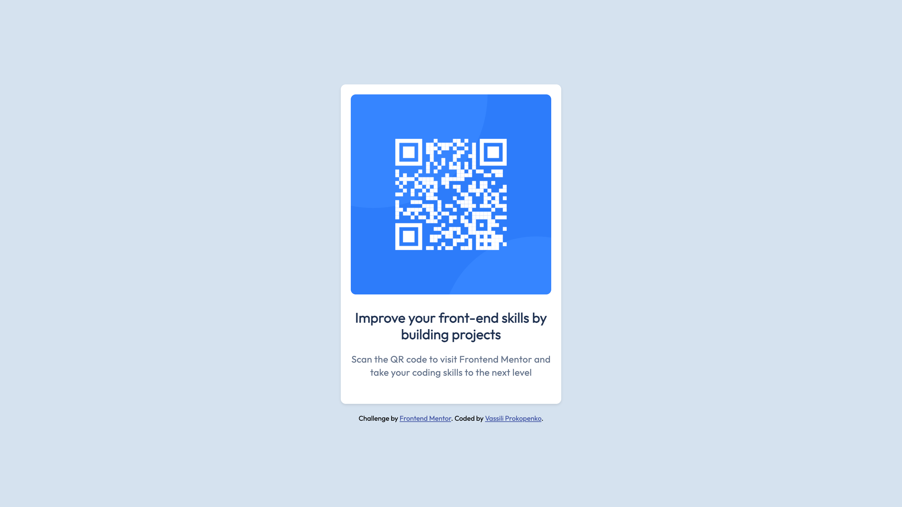

# Frontend Mentor - QR code component solution

This is a solution to the [QR code component challenge on Frontend Mentor](https://www.frontendmentor.io/challenges/qr-code-component-iux_sIO_H).

## Overview

### Screenshot

### Links

- Live Site URL: [Github Pages](https://vassiliproko.github.io/fm-qr-code/)

### Built with

- HTML
- CSS

## Author

- Website - [https://vassiliprokopenko.com](https://vassiliprokopenko.com)
- Linkedin - [/in/vassili-prokopenko](https://www.linkedin.com/in/vassili-prokopenko/)
